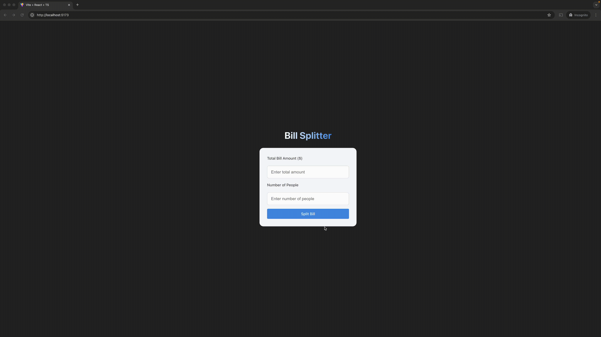

# Bill Split App


## Overview
This is a full-stack application for splitting bills among groups of people. The application consists of a React frontend and a Node.js Express backend.

## Assessment Details

### Expectation
The goal of this assessment is to gauge your technical skills and soft skills such as problem-solving and communication abilities.

We do not expect a perfect solution. We focus more on you walking us through your thought process and working together as if it were a real-life pair programming session.

Do not shy away from asking questions.

## Getting Started
You will be given a React frontend app and Node.js Express backend app in a half-working state. Please clone this repository locally and start screen sharing


### Project Structure
```
.
├── client/          # React frontend application
├── server/           # Node.js Express backend application
├── setup.md          # Setup instructions
└── tasks.md          # Task requirements and guidelines
```


### Steps

1. Follow the [setup instructions](./setup.md) to get your development environment ready
2. Review the [tasks](./tasks.md) to understand what needs to be implemented
3. Begin working on the tasks while maintaining good communication about your approach
